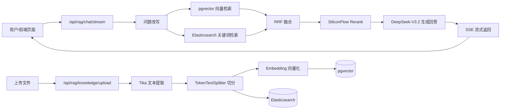

# BetterRAG


> 面向企业内部知识库的 RAG 系统：文档上传入库，向量 + 关键词混合检索，流式问答。
> 技术栈：Spring Boot + Spring AI + pgvector + Elasticsearch + SiliconFlow（DeepSeek / Qwen 系列）。

---

## 项目亮点

- **混合检索**：pgvector 向量检索 + Elasticsearch 关键词检索（`ik_smart` 分词），RRF 融合排序，兼顾语义与精确匹配
- **Rerank 重排**：SiliconFlow `Qwen3-Reranker-8B` 对候选片段精排，失败时自动降级为向量分数排序，保证链路可用
- **SSE 流式回答**：基于 `SseEmitter`（非 Flux 接口），边生成边推送
- **完整对话体验**：会话内多轮记忆、异步生成会话标题、回答完成后推送推荐问题
- **依据来源可追溯**：回答基于 Rerank 后的命中片段，按文件聚合推送来源，答案可解释
- **问题改写**：检索前先对用户问题改写，提升召回质量
- **文档解析**：上传支持 `DOC` / `DOCX` / `PDF` / `MD`，`Apache Tika` 提取文本，`TokenTextSplitter` 切分
- **MCP 工具体系**：独立 `betterrag-mcp-server` 模块（天气、汇率工具），主应用以 MCP Client 方式接入，模型可按需调用
- **内置前端页面**：跟随后端一起启动，无需单独前端工程

---

## 架构流程



---

## 技术栈

- Java `17`
- Spring Boot `4.0.1`
- Spring AI `2.0.0-M2`（含 `spring-ai-rag` 检索增强模块、MCP 客户端/服务端）
- PostgreSQL + pgvector（向量库，HNSW 索引，`cosine_distance`）
- Elasticsearch（关键词检索，`ik_smart` 分析器）
- SiliconFlow
  - 对话模型：`deepseek-ai/DeepSeek-V3.2`（OpenAI 兼容接口）
  - 向量模型：`Qwen/Qwen3-Embedding-8B`（1536 维）
  - 重排模型：`Qwen/Qwen3-Reranker-8B`（`/v1/rerank` 接口）
- Apache Tika `2.9.2`

---

## 快速开始

### 1）前置条件

- PostgreSQL（安装 `pgvector` 扩展）并创建数据库：

```sql
CREATE DATABASE betterrag;
\c betterrag
CREATE EXTENSION IF NOT EXISTS vector;
```

- Elasticsearch（默认 `localhost:9200`，建议安装 `ik` 分词插件）
- 可用 SiliconFlow API Key
- JDK 17+

### 2）环境变量

```bash
export SILICONFLOW_API_KEY=你的真实Key
# 以下均有默认值，按需覆盖
export PGVECTOR_URL='jdbc:postgresql://localhost:5432/betterrag'
export PGVECTOR_USERNAME=postgres
export PGVECTOR_PASSWORD=postgres
export ELASTICSEARCH_URL=http://localhost:9200
export ES_ANALYZER=ik_smart
```

### 3）启动项目

先启动 MCP Server（端口 `8081`），再启动主应用（端口 `8080`）：

```bash
./mvnw -pl betterrag-mcp-server spring-boot:run
./mvnw -pl betterrag-bootstrap spring-boot:run
```

浏览器访问：`http://localhost:8080/`

- 左侧菜单「上传文件」：文档入库与向量化（pgvector + Elasticsearch 双写）
- 左侧菜单「流式问答」：企业知识库问答

---

## 核心接口

### 1）上传文件并向量化

`POST /api/rag/knowledge/upload`

- `Content-Type`: `multipart/form-data`
- 参数：
  - `file`（必填）：仅支持 `DOC` / `DOCX` / `PDF` / `MD` / `MARKDOWN`
  - `kb`（可选）：知识库标识，默认 `default`
- 文件大小限制：默认 `20MB`

```bash
curl -X POST 'http://localhost:8080/api/rag/knowledge/upload' \
  -F 'file=@./docs/employee-handbook.md' \
  -F 'kb=hr'
```

示例返回：

```json
{
  "fileName": "employee-handbook.md",
  "kb": "hr",
  "chunkCount": 12
}
```

---

### 2）流式 RAG 问答

`POST /api/rag/chat/stream`

- `Content-Type`: `application/json`
- 返回类型：`text/event-stream`
- 请求体：

```json
{
  "question": "年假最多可以累计多少天？",
  "kb": "hr",
  "sessionId": "可选，多轮对话时回传上一轮返回的 sessionId"
}
```

```bash
curl -N -X POST 'http://localhost:8080/api/rag/chat/stream' \
  -H 'Content-Type: application/json' \
  -d '{"question":"年假最多可以累计多少天？","kb":"hr"}'
```

SSE 事件：

- `meta`：当前会话 `sessionId`
- `title`：异步生成的会话标题
- `token`：模型流式输出
- `sources`：命中的依据片段来源（Rerank 后文档，按文件聚合）
- `suggestions`：推荐问题
- `done`：回答完成
- `error`：异常信息

---

## 配置速查

配置文件：`betterrag-bootstrap/src/main/resources/application.yaml`

### 模型与 SiliconFlow

- `spring.ai.openai.base-url`（默认 `https://api.siliconflow.cn`）
- `spring.ai.openai.api-key`
- `spring.ai.openai.chat.options.model`（默认 `deepseek-ai/DeepSeek-V3.2`）
- `spring.ai.openai.embedding.options.model`（默认 `Qwen/Qwen3-Embedding-8B`，1536 维）

### RAG 主流程参数

- `app.rag.rewrite-model` / `app.rag.answer-model`
- `app.rag.rerank-model`（默认 `Qwen/Qwen3-Reranker-8B`）
- `app.rag.rerank-endpoint`（默认 SiliconFlow Rerank 地址）
- `app.rag.retrieve-top-k`（向量检索条数，默认 `8`）
- `app.rag.rerank-top-n`（重排后保留条数，默认 `4`）
- `app.rag.rerank-max-document-chars`
- `app.rag.memory-max-messages`（会话记忆条数，默认 `20`）

### 混合检索参数

- `app.rag.keyword-top-k`（ES 关键词检索条数，默认 `8`）
- `app.rag.rrf-k`（RRF 融合参数，默认 `60`）
- `app.rag.es-analyzer`（默认 `ik_smart`）
- `app.rag.es-url`（默认 `http://localhost:9200`）

### Chunk 切分参数（固定策略）

- `app.rag.chunk-size`
- `app.rag.min-chunk-size-chars`
- `app.rag.min-chunk-length-to-embed`
- `app.rag.max-num-chunks`

### 上传大小限制

- `spring.servlet.multipart.max-file-size`（默认 `20MB`）
- `spring.servlet.multipart.max-request-size`（默认 `20MB`）

---

## Rerank 说明

Rerank 不走 OpenAI Chat 兼容接口，而是调用 SiliconFlow 的 `/v1/rerank` 接口。

请求结构：

```json
{
  "model": "Qwen/Qwen3-Reranker-8B",
  "query": "用户问题",
  "documents": ["候选文本1", "候选文本2"],
  "top_n": 4
}
```

实现策略：

- 超长候选文本截断至 `rerank-max-document-chars` 后再送入重排
- Rerank 整体失败时，自动降级为按向量分数排序，不影响主流程

---

## 提示词模板

提示词已模板化，不写死在 Java 代码中：

- `betterrag-bootstrap/src/main/resources/prompts/rewrite-system.st` / `rewrite-user.st`（问题改写）
- `betterrag-bootstrap/src/main/resources/prompts/answer-system.st` / `answer-user.st`（回答生成）
- `betterrag-bootstrap/src/main/resources/prompts/title-system.st` / `title-user.st`（会话标题）
- `betterrag-bootstrap/src/main/resources/prompts/suggestions-system.st` / `suggestions-user.st`（推荐问题）

你可以直接调整模板来迭代效果，不需要改业务代码。

---

## 项目结构

```text
betterrag
├── betterrag-bootstrap                # 主应用：RAG 问答与知识入库
│   └── src/main/java/com/betterrag
│       ├── BetterRAGApplication.java
│       ├── config                      # RAGConfiguration / RAGProperties
│       ├── controller                  # RAGController / GlobalExceptionHandler
│       ├── model                       # RAGRequest / UploadResponse
│       └── service
│           ├── RAGService              # 流式问答编排
│           ├── KnowledgeIngestionService  # 文档解析、切分、双写入库
│           ├── RerankService           # SiliconFlow Rerank 客户端
│           ├── SuggestionService       # 推荐问题生成
│           └── rag                     # Spring AI RAG 扩展点
│               ├── HybridDocumentRetriever        # 向量 + 关键词混合检索（RRF）
│               ├── KeywordDocumentRetriever       # ES 关键词检索
│               ├── ElasticsearchDocumentRepository # ES 文档仓库
│               ├── RewriteQueryTransformer        # 问题改写
│               ├── RerankDocumentPostProcessor    # 重排 + 降级策略
│               └── NonReturnDirectToolCallback    # MCP 工具回调封装
└── betterrag-mcp-server               # 独立 MCP Server：天气、汇率工具（端口 8081）
```

内置前端页面：

- `betterrag-bootstrap/src/main/resources/static/index.html`

---

## 开发路线图

- [x] 流式 RAG 问答（SSE）
- [x] 文档上传、解析、切分、向量化入库
- [x] 问题改写 + Rerank 重排（含降级策略）
- [x] 混合检索（pgvector 向量 + Elasticsearch 关键词，RRF 融合）
- [x] 依据来源推送、会话标题生成、推荐问题
- [x] MCP 工具接入（独立 Server 模块）
- [x] 基于模板文件的提示词管理
- [ ] 引用片段高亮与答案可解释性增强
- [ ] 增加离线评测脚本（召回率/准确率）
- [ ] 增加多知识库权限隔离（企业多租户）

---

## 参与贡献

欢迎通过 PR 与问题单参与改进。

### 提交流程

1. 在代码托管平台 Fork 本仓库并创建功能分支
2. 本地开发并保证编译通过：

```bash
./mvnw -DskipTests compile
```

3. 提交前自查：
   - 接口行为未破坏现有功能
   - 配置项和 README 一致
   - 新增能力有最小可复现说明
4. 发起 PR，描述变更背景、方案与测试方式

### 问题反馈建议包含

- 问题现象与日志
- 复现步骤
- 期望行为
- 运行环境（JDK、PostgreSQL/pgvector、Elasticsearch、模型配置）

---

## 更新日志

### 2026-09-21

- 项目更名为 **BetterRAG**：包名 `com.betterrag`、模块与 Maven 坐标、配置与前端文案统一调整
- README 对齐当前实现（pgvector + Elasticsearch 混合检索 + SiliconFlow 模型体系）

### 2026-02-10

- 统一类命名为 `RAG*`（如 `RAGController`、`RAGService`、`RAGConfiguration`）
- 精简 Controller，流式编排逻辑下沉到 `RAGService`
- 修复 `TaskExecutor` 多 Bean 注入歧义，使用 `RAGTaskExecutor`
- 上传链路改为仅文档类型（`DOC`/`DOCX`/`PDF`/`MD`）并使用 `Tika` 解析
- 前端拆分为「上传文件 / 流式问答」双页签，优化交互与视觉
- Rerank 对齐原生接口参数，规避兼容模式报错

---

## 开源许可证

本项目基于 `Apache License 2.0` 开源，详见 `LICENSE`。

本项目基于 [nageoffer/tinyrag](https://github.com/nageoffer/tinyrag)（Apache-2.0）二次开发，在其基础上完成了混合检索、重排降级、多轮对话、推荐问题与 MCP 工具体系等增强，遵循原协议保留版权与许可声明。
